## 一、流水线中的相关
流水线中经常有一些被称为“相关”的情况发生，它使得指令序列中下一条指令无法按照设计的时钟周期执行，这些“相关”会降低流水线性能。
- （1） 结构相关：流水线中指令执行过程中，发生硬件资源冲突而产生的相关
- （2） 数据相关：流水线中执行的几条指令中，一条指令依赖于前面执行的指令
- （3） 控制相关：流水线中分支指令或者其他需要改写PC的指令造成的相关

### 1.1 数据相关
- RAW：假设指令j是在指令i后面执行的指令 `->` 指令i将数据写入寄存器后，指令j才能从这个寄存器读取数据，如果指令j在指令i写入寄存器前尝试读出该寄存器的内容，将得到不正确的数据
- WAR：假设指令j是在指令i后面执行的指令 `->` 指令i从寄存器读取数据后，指令j才能将数据写入这个寄存器，如果指令j在指令i读取寄存器前尝试写入该寄存器，将使得i读出不正确的数据
- WAW：假设指令j是在指令i后面执行的指令 `->` 指令i将数据写入寄存器后，指令j才能将数据写入这个寄存器，如果指令j在指令i写入寄存器前尝试写该寄存器的内容，将使得该寄存器的值不是最新值

对于我们设计的OpenMIPS五级流水线而言，只有在流水线回写阶段才会写寄存器，因此不存在**WAW**相关；只能在流水线译码阶段读寄存器、回写阶段写寄存器，因此不存在**WAR**相关；所以OpenMIPS的流水线只存在**RAW**相关。

### 1.2 RAW 相关有三种情况

1. 相邻指令间存在数据相关
```
ori $1, $0, 0x1100  # $1 = $0 | 0x1100 = 0x1100
ori $2, $1, 0x0020  # $2 = $1 | 0x0020 = 0x1120
```

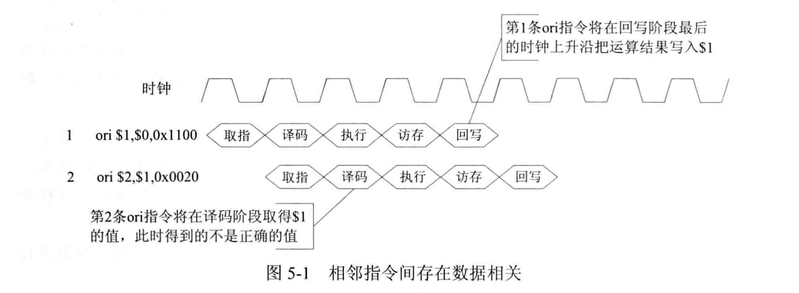
**说明：**第一条ori指令将写寄存器$1，第二条ori指令需要读寄存器$1的数据；但是如图所示，第二条指令读寄存器在第一条指令写寄存器之前，导致读出错误的数据

2. 相隔1条指令的指令间存在数据相关
```
ori $1, $0, 0x1100  # $1 = $0 | 0x1100 = 0x1100
ori $3, $0, 0xffff      # $3 = $0 | 0xffff = 0xffff
ori $2, $1, 0x0020  # $2 = $1 | 0x0020 = 0x1120
```


**说明：**第一条ori指令将写寄存器$1，第三条ori指令在译码阶段需要读寄存器$1的数据；但是如图所示，第三条指令读寄存器在第一条指令写寄存器之前，导致读出错误的数据

3. 相隔2条指令的指令间存在数据相关

```
ori $1, $0, 0x1100  # $1 = $0 | 0x1100 = 0x1100
ori $3, $0, 0xffff      # $3 = $0 | 0xffff = 0xffff
ori $4, $0, 0xffff      # $4 = $0 | 0xffff = 0xffff
ori $2, $1, 0x0020  # $2 = $1 | 0x0020 = 0x1120
```

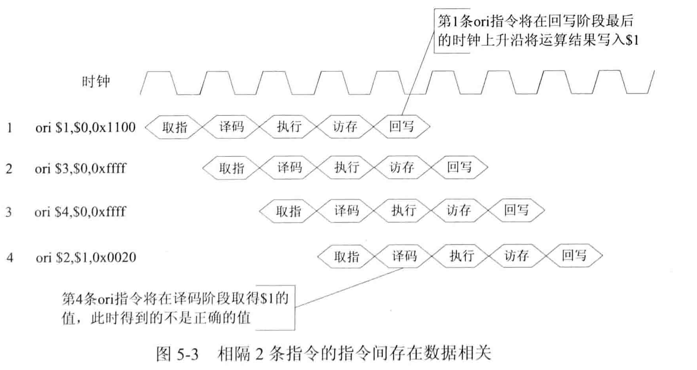

**说明：**第一条ori指令将写寄存器$1，第四条ori指令在译码阶段需要读寄存器$1的数据；但是如图所示，第一条指令处于回写阶段，**在回写阶段最后的时钟上升沿**才会将运算结果写入$1，所以第四条指令得到的不是正确的寄存器$1的值

### 1.3 RAW相关的解决方法

#### 1.3.1 “相隔2条指令间存在数据相关“这种情况已经在`regfile.v`中解决了

```verilog
	// 3. read port1's read operation
	always @ (*) begin
		...
		// if read port1 want read register is same as the register to write
	  	else if((raddr1 == waddr) && (we == `WriteEnable) && (re1 == `ReadEnable)) begin
	  	  rdata1 <= wdata;
	  	end 
		...
	end
```
在读操作中有一个判断，如果要读取的寄存器是在下一个时钟上升沿要写入的寄存器，那么就将要写入的数据直接作为结果输出。

#### 1.3.2  相邻指令间存在数据相关、相隔1条指令的指令间存在数据相关的解决方法

1. 插入暂停周期：当检测到相关时，在流水线中插入一些暂停周期

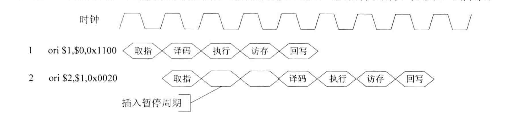

2. 编译器调度：编译器检测到相关后，可以改变部分指令的执行顺序

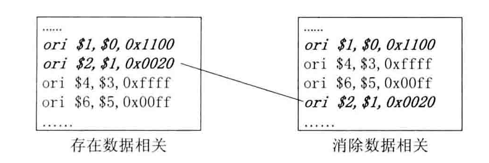

3. 数据前推：将计算结果从其产生处直接推送到其他指令需要处或所有需要的功能单元处，避免流水线暂停。

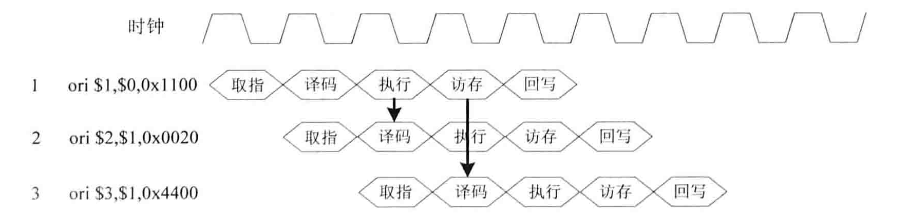

新的$1 值实际上在第1条ori指令的执行阶段已经计算出来了，可以直接将该值从第1条ori指令的执行阶段送入第2条ori指令的译码阶段，从而使第2条ori指令在译码阶段得到$1的新值。也可以直接将该值从第1条ori指令的访存阶段送入第3条ori指令的译码阶段，从而使第3条ori指令在译码阶段也得到$1的新值。

**注意：**第3种方法有一个前提就是**新的寄存器的值可以在执行阶段计算出来**，如果是**加载指令，那么就不满足这个前提**，因为加载指令在访存阶段才能获得最终结果，这是一种load 相关，将在实现加载存储指令的时候考虑这种情况，这时暂不考虑。

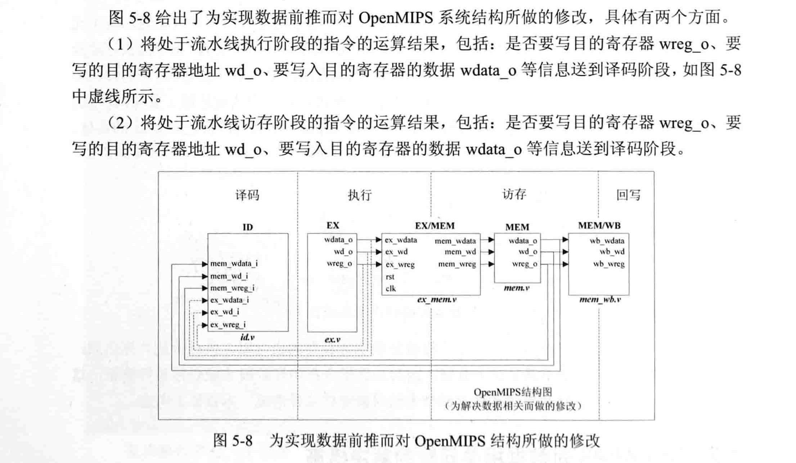

为此，译码阶段的ID模块要增加6个接口，如下表所示：
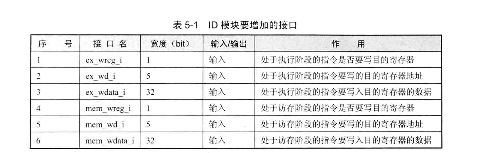

给出存在RAW相关情况的inst_rom.S文件：
```
.org 0x0                     # program address start from 0x0 
.global _start              # define global symbol '_start'
.set noat                    # permit use reg '$1' freely
_start:
  ori $1, $0, 0x1100   # $1 = $0 | 0x1100 = 0x1100
  ori $1, $1, 0x0020   # $1 = $1 | 0x0020 = 0x1120
  ori $1, $1, 0x4400   # $1 = $1 | 0x4400 = 0x5520
  ori $1, $1, 0x0044   # $1 = $1 | 0x0044 = 0x5564
```

运行仿真，观察寄存器值的变化，符合预期
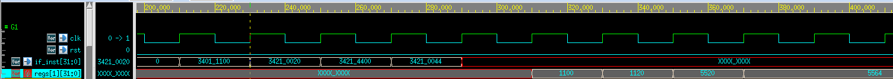

# 二、逻辑、移位操作与空指令

MIPS32 指令集架构中定义的逻辑操作指令有8条：and、andi、or、ori、xor、xori、nor、lui
MIPS32 指令集架构中定义的移位操作指令有6条：sll、sllv、sra、srav、srl、srlv

MIPS32 指令集架构中定义的空指令有2条：nop、ssnop
其中，ssnop是一种特殊类型的空操作，在每个周期发射多条指令的CPU中，使用ssnop指令可以确保单独占用一个发射周期。
OpenMIPS设计为标量处理器，也就是每周期发射一条指令，所以ssnop的作用与nop相同，可以按照nop指令的处理方式来处理ssnop
sync：保证加载、存储操作的顺序，对与OpenMIPS而言，严格按照指令顺序执行的，可以将sync指令当作空指令处理
pref：缓存预取，OpenMIPS没有实现缓存，所以也可以将pref指令当作nop指令处理，此处也将其归纳为空指令

## 1. and、or、xor、nor

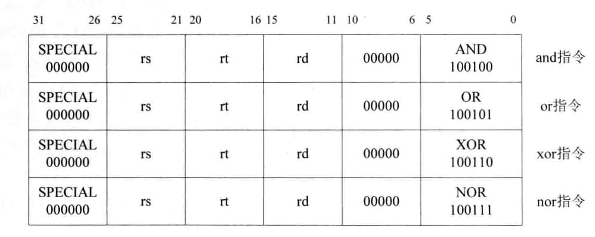

指令用法：instruction rd， rs， rt
指令作用：rd = rs instruction rt
and：“与”运算
or：“或”运算
xor：“异或”运算
nor：“或非”运算

# 2. andi、xori

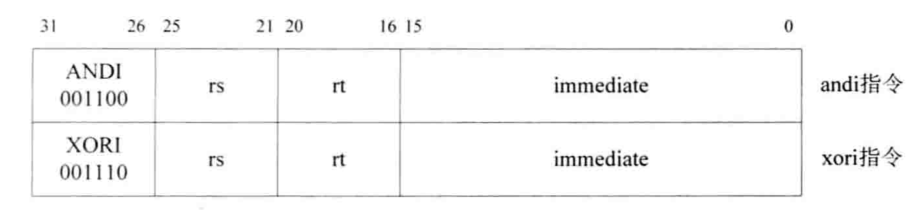

指令用法：instruction rt，rs，immediate
指令作用：rt = rs instruction immediate
andi：和立即数“与”运算
xori：和立即数“或”运算

# 3. lui

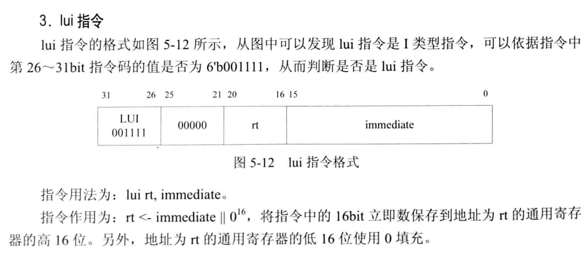

指令用法：lui rt，immediate
指令作用：rt = {immediate ,16‘bit0}
将指令中的16bit立即数保存到地址为rt的通用寄存器的`高16位`，低16位使用0填充

# 4. ssl、srl、sra、srav、sllv、srlv

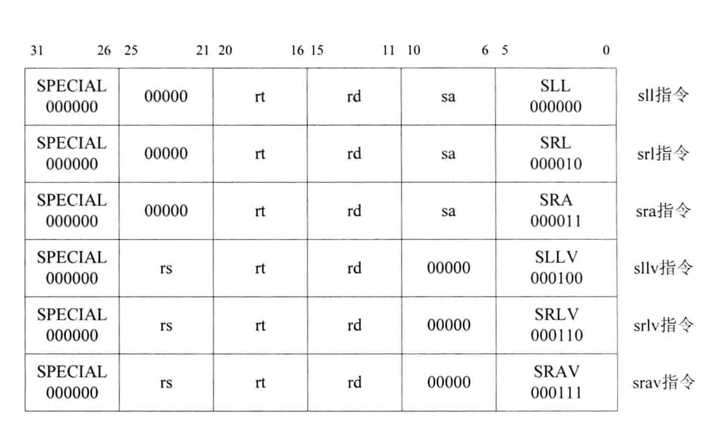

指令用法：instruction rd，rt，imm/rs
指令作用：rd = rt instruction imm/rs
ssl：逻辑左移
srl：逻辑右移
sra：算术左移
srav：算术右移
sllv：逻辑左移
srlv：逻辑右移

**总结：**
逻辑右移，最高位补0，算术右移，最高位补符号位
sllv、srav、srlv这3条指令最后有‘v’，表示移位位数是通过寄存器确定
sll、sra、srl这3条指令最后没有‘v’，表示移位位数就是指令中第6～10bit的sa值

# 5. nop、ssnop、sync、pref

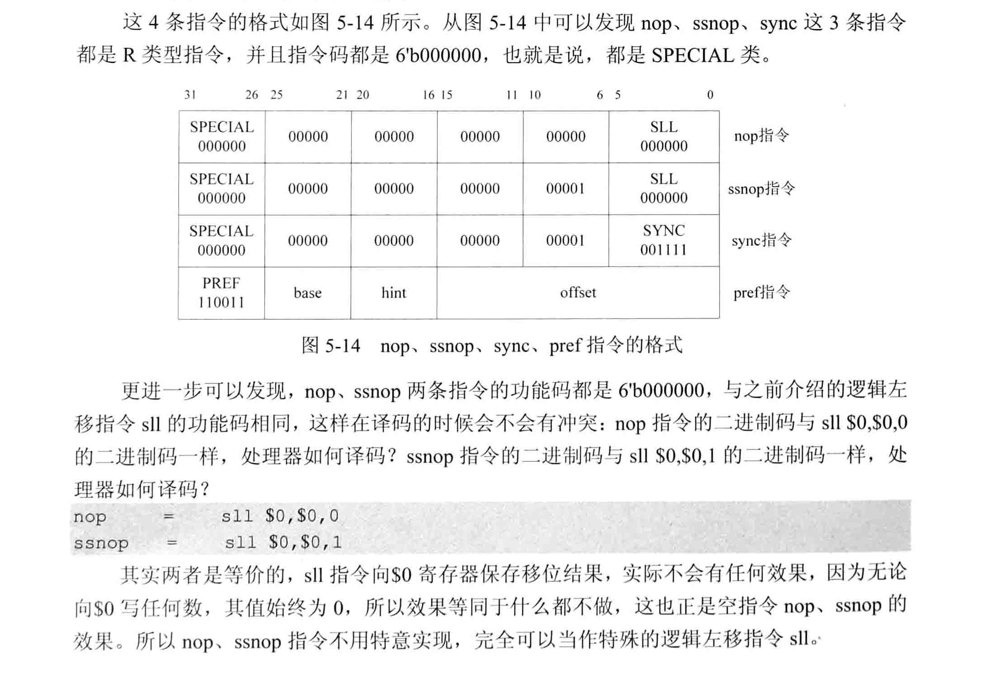

向$0寄存器写任何数，其值始终为0，效果等同于什么都不做
nop、ssnop指令不用特意实现，完全可以当作特殊的逻辑左移指令sll

# 三、修改OpenMIPS以实现逻辑、移位操作与空指令

只需要修改OpenMIPS的两个模块：
1. 修改译码阶段的ID模块，用以实现对上述指令的译码
2. 修改执行阶段的EX模块，使其按照译码结果进行运算

确定指令种类：
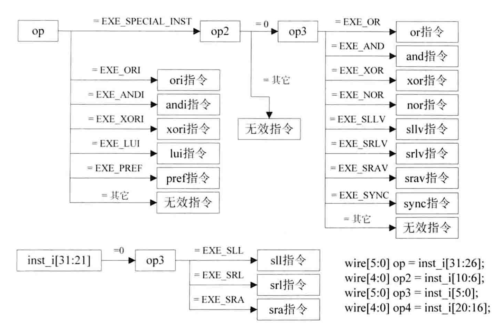

op：指令的第26～31bit，即指令码
op2：指令的第6～10bit
op3：指令的第0～5bit，即功能码
op4：指令的第16～20bit

# 四、测试
## 4.1 测试程序1——逻辑操作
```
.org 0x0
.global _start
.set noat
_start:
   lui  $1,0x0101
   ori  $1,$1,0x0101
   ori  $2,$1,0x1100         # $2 = $1 | 0x1100 = 0x01011101
   or   $1,$1,$2                # $1 = $1 | $2 = 0x01011101
   andi $3,$1,0x00fe        # $3 = $1 & 0x00fe = 0x00000000
   and  $1,$3,$1              # $1 = $3 & $1 = 0x00000000
   xori $4,$1,0xff00          # $4 = $1 ^ 0xff00 = 0x0000ff00
   xor  $1,$4,$1               # $1 = $4 ^ $1 = 0x0000ff00
   nor  $1,$4,$1               # $1 = $4 ~^ $1 = 0xffff00ff   nor is "not or"
```

波形图：

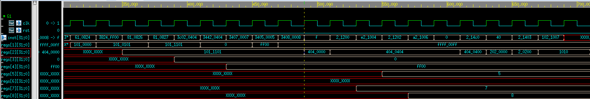
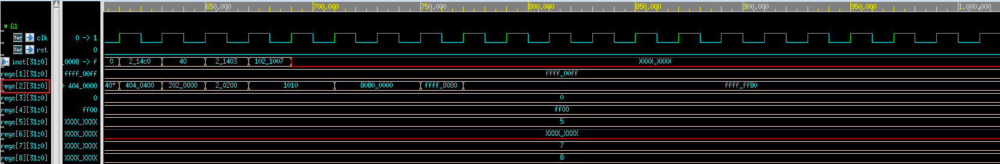

满足 
```
   lui  $1,0x0101              # $1 = 0x01010000
   ori  $1,$1,0x0101         # $1 = 0x01010101
   ori  $2,$1,0x1100         # $2 = $1 | 0x1100 = 0x01011101
   or   $1,$1,$2                # $1 = $1 | $2 = 0x01011101
   andi $3,$1,0x00fe        # $3 = $1 & 0x00fe = 0x00000000
   and  $1,$3,$1              # $1 = $3 & $1 = 0x00000000
   xori $4,$1,0xff00          # $4 = $1 ^ 0xff00 = 0x0000ff00
   xor  $1,$4,$1               # $1 = $4 ^ $1 = 0x0000ff00
   nor  $1,$4,$1               # $1 = $4 ~^ $1 = 0xffff00ff   nor is "not or"

   lui  $1,0x0101              # $1 = 0x01010000
   ori  $1,$1,0x0101         # $1 = 0x01010101
   ori  $2,$1,0x1100         # $2 = $1 | 0x1100 = 0x01011101
   or   $1,$1,$2                # $1 = $1 | $2 = 0x01011101
   andi $3,$1,0x00fe        # $3 = $1 & 0x00fe = 0x00000000
   and  $1,$3,$1              # $1 = $3 & $1 = 0x00000000
   xori $4,$1,0xff00          # $4 = $1 ^ 0xff00 = 0x0000ff00
   xor  $1,$4,$1               # $1 = $4 ^ $1 = 0x0000ff00
   nor  $1,$4,$1               # $1 = $4 ~^ $1 = 0xffff00ff   nor is "not or"

   lui   $2,0x0404             # $2 = 0x04040000 
   ori   $2,$2,0x0404        # $2 = 0x04040404
   ori   $7,$0,0x7              # $7 = 0x00000007
   ori   $5,$0,0x5              # $5 = 0x00000005
   ori   $8,$0,0x8              # $8 = 0x00000008
   sync
   sll   $2,$2,8    # $2 = 0x40404040 sll 8  = 0x04040400
   sllv  $2,$2,$7   # $2 = 0x04040400 sll 7  = 0x02020000
   srl   $2,$2,8    # $2 = 0x02020000 srl 8  = 0x00020200
   srlv  $2,$2,$5   # $2 = 0x00020200 srl 5  = 0x00001010
   nop
   sll   $2,$2,19   # $2 = 0x00001010 sll 19 = 0x80800000
   ssnop
   sra   $2,$2,16   # $2 = 0x80800000 sra 16 = 0xffff8080
   srav  $2,$2,$8   # $2 = 0xffff8080 sra 8  = 0xffffff80 
```


