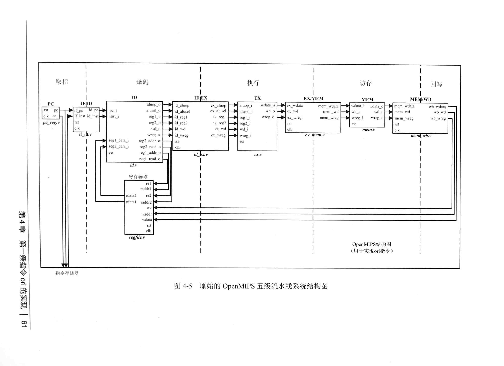
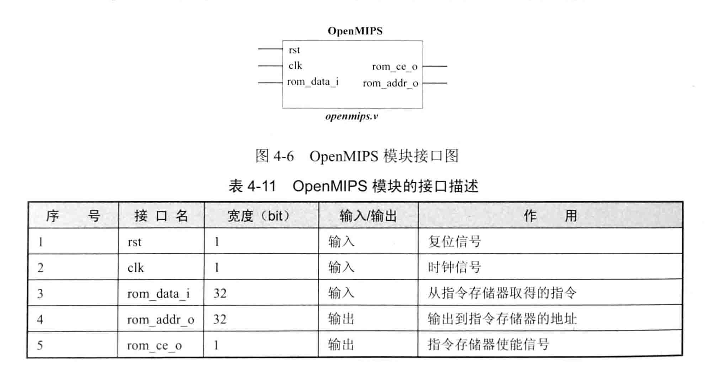
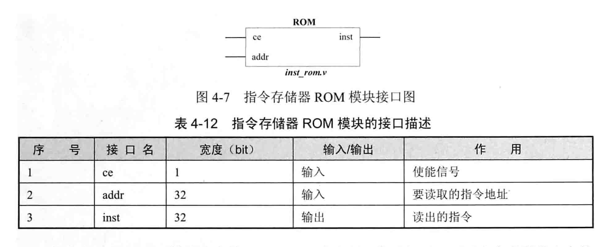
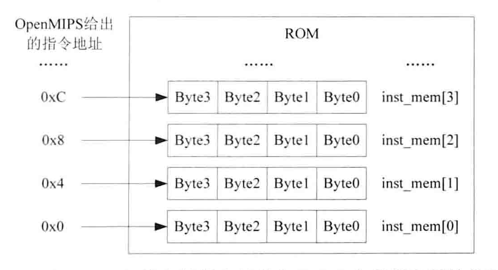

<!--
 * @Author: ywh
 * @Description: readme
 * @Date: 2024-04-11 11:14:10
-->
**实现`ori`指令的OpenMIPS五级流水线结构图**

**说明：**
## 一、取指阶段：取出指令存储器中的指令，同时PC值递增，准备取下一条指令

1. PC模块(pc_reg.v)：给出指令地址
2. IF/ID模块(if_id.v)：暂时保存取指阶段取得的指令

## 二、译码阶段：对取到的指令进行译码 -> 给出要进行的运算类型，以及参与运算的操作数

1. Regfile模块(regfile.v)：实现32个32位通用整数寄存器，可以同时进行两个寄存器的读操作和一个寄存器的写操作
2. ID模块(id.v)：对指令进行译码，得到最终运算的类型、子类型、源操作数1、源操作数2、要写入的目的寄存器地址等信息
3. ID/EX模块(id_ex.v)：将ID模块译码阶段取得的结果在下个时钟传递到流水线执行阶段

## 三、执行阶段：依据译码阶段的结果，对源操作数1、源操作数2、进行指定的运算

1. EX模块(ex.v)：从ID/EX模块得到运算的类型、子类型、源操作数1、源操作数2、要写入的目的寄存器地址，并依据这些数据进行计算
2. EX/MEM模块(ex_mem.v)：将执行阶段取得的运算结果在下个时钟传递到流水线访存阶段

## 四、访存阶段：由于ori指令不需要访问数据存储器，所以在访存阶段不做任何事，只是简单地将执行阶段的结果向写回阶段传递

1. MEM模块(mem.v)：将输入的执行阶段的结果直接作为输出
2. MEM/WB模块(mem_wb.v)：将访存阶段的运算结果，在下一个时钟传递到回写阶段

## 五、回写阶段：将指令的运算结果写入目的寄存器
1. Regfile模块(regfile.v):将指令的运算结果写入目的寄存器

**`ori`指令格式**

地址为rs的寄存器的值 = 立即数 or 地址为rt的寄存器的值
目的操作数 = 源操作数1 || 源操作数2

**验证OpenMIPS实现效果**

`指令存储器ROM`

1. 在初始化指令存储器时使用了`initial`过程语句，不能被综合工具支持，若想被综合修改初始化指令存储器的方法
2. `$readmemh`读取数据的系统函数，表示从inst_rom.data文件中读取数据以初始化inst_mem
3. OpenMIPS是按字节寻址的，而此处定义的指令存储器的每个地址是一个32bit的字，所以要将OpenMIPS给出的地址除以4再使用

`最小SOPC`
为了验证建立一个SOPC：OpenMIPS从指令存储器读取指令，指令进入OpenMIPS开始执行

`使用VCS和verdi联合仿真结果`

1. if_inst是取到的指令，从仿真可知，依次取出inst_rom.data中的指令
2. 观察regs[1]、regs[2]、regs[3]、regs[4]的最终值，可知OpenMIPS正确执行了程序